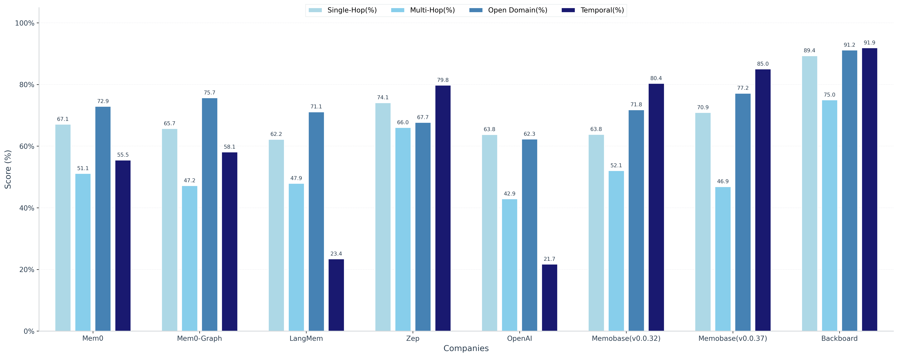
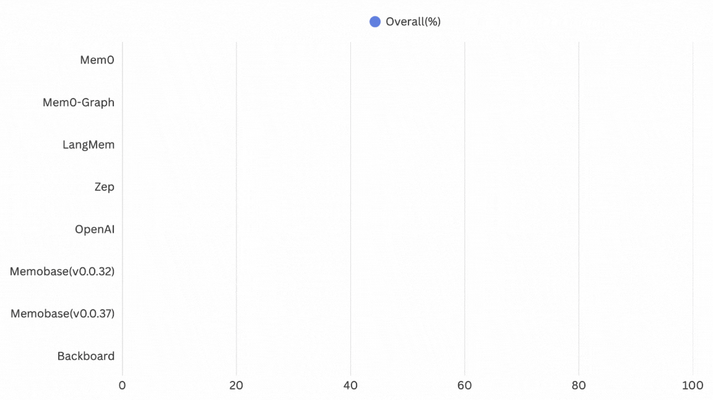

# Backboard LoCoMo Benchmark Results

A comprehensive evaluation framework for Backboard's memory system using the LoCoMo (Long Conversation Memory) benchmark. This repository contains the code and results demonstrating Backboard's state-of-the-art performance across multiple memory dimensions.

## Overview

The LoCoMo benchmark is designed to test memory systems across multiple dimensions of conversational AI, evaluating the ability to maintain context, recall information, and reason across extended dialogues. This benchmark provides a standardized way to compare different memory systems on identical tasks.

## Performance Comparison



### Overall Performance Ranking



### Results Summary

Backboard achieves state-of-the-art performance across all question categories, demonstrating superior memory capabilities compared to leading alternatives.

| Method | Single-Hop (%) | Multi-Hop (%) | Open Domain (%) | Temporal (%) | Overall (%) |
|--------|---------------|---------------|-----------------|--------------|-------------|
| **Backboard** | **89.36** | **75.00** | **91.20** | **91.90** | **90.00** |
| Memobase (v0.0.37) | 70.92 | 46.88 | 77.17 | 85.05 | 75.78 |
| Zep | 74.11 | 66.04 | 67.71 | 79.79 | 75.14 |
| Memobase (v0.0.32) | 63.83 | 52.08 | 71.82 | 80.37 | 70.91 |
| Mem0-Graph | 65.71 | 47.19 | 75.71 | 58.13 | 68.44 |
| Mem0 | 67.13 | 51.15 | 72.93 | 55.51 | 66.88 |
| LangMem | 62.23 | 47.92 | 71.12 | 23.43 | 58.10 |
| OpenAI | 63.79 | 42.92 | 62.29 | 21.71 | 52.90 |

## Quick Start

### Prerequisites

- Python 3.8 or higher
- Backboard API key
- OpenAI API key (for LLM-based evaluation)
- Required dependencies (see `requirements.txt` in this directory)

### Installation

1. Clone the repository and navigate to the benchmark directory:
```bash
cd Locomo\ Benchmark/
```

2. Install dependencies:
```bash
pip install -r requirements.txt
```

### Configuration

Create a `.env` file in the project root with your API credentials:

```bash
# Backboard API Configuration
BACKBOARD_API_KEY=your_backboard_api_key_here
API_BASE_URL=https://app.backboard.io/api

# OpenAI API Configuration (for evaluation)
OPENAI_API_KEY=your_openai_api_key_here
```

### Running the Benchmark

Execute the evaluation:

```bash
python locomo_ingest_eval.py
```

This will:
1. Load the LoCoMo dataset from `locomo_dataset.json`
2. Create isolated assistants for each conversation
3. Ingest all conversation turns into Backboard's memory system
4. Execute test questions at designated points
5. Evaluate responses against ground truth using LLM-based scoring
6. Generate comprehensive accuracy reports

### Output

The benchmark generates real-time progress updates and comprehensive results:

**During Execution:**
```
================================================================================
📍 Conversation 1/10
================================================================================

🆕 Creating new assistant for conversation 1...
Created assistant: LoCoMo Test Assistant abc12345 (asst_xxx)

Loading 3 conversation sessions...

   Session 1/3
      Thread: thread_xxx
      Session datetime (original): 1:56 pm on 8 May, 2023
      Session datetime (ISO 8601): 2023-05-08T13:56:00Z
      Loading 15 turns Done

   ======================================================================
   Question 1/25 [single_hop]
   What did Sarah order for lunch?

   AI Response: Sarah ordered a Caesar salad with chicken.

   Expected Answer: Caesar salad
   Response Time: 2.34s
   Evaluating with LLM judge... ✓ CORRECT
   Judge Reasoning: The answer correctly identifies the Caesar salad order.
   📊 Running Accuracy: 1/1 correct (100.0%)
```

**Final Console Output:**
```
================================================================================
Final Results
================================================================================

Overall Performance:
   Total Questions: XXX

================================================================================
Per-Conversation Accuracy
================================================================================
   Conv  1 (conv-XX): XX/XX correct (XX.X%)
   Conv  2 (conv-XX): XX/XX correct (XX.X%)
   Conv  3 (conv-XX): XX/XX correct (XX.X%)
   ...
   Conv 10 (conv-XX): XX/XX correct (XX.X%)

   📊 Average Accuracy Across N Conversations: XX.X%

================================================================================
LLM Judge Evaluation (GPT-4.1)
================================================================================
   Questions Evaluated: XXX/XXX
   Correct Answers: XXX/XXX
   Overall Accuracy: XX.X%

Breakdown by Question Type (Category):
   single_hop               : XXX questions | XXX/XXX correct | Accuracy: XX.X%
   multi_hop                : XX questions | XX/XX correct | Accuracy: XX.X%
   open_domain              : XXX questions | XXX/XXX correct | Accuracy: XX.X%
   temporal_reasoning       : XXX questions | XXX/XXX correct | Accuracy: XX.X%

Average Response Time: X.XXs

Detailed results saved to: results/locomo_results_[timestamp].json
```

**Generated Files:**

In `results/` directory:
- `locomo_results_[timestamp].json`: Complete evaluation with all metrics and Q&A pairs
- `locomo_conversation_1_[conv-id]_[timestamp].json`: Per-conversation detailed results
- `locomo_conversation_2_[conv-id]_[timestamp].json`: (one file per conversation)
- ... (N total conversation files)

### Configuration Options

Edit `locomo_ingest_eval.py` to customize:

```python
# Dry run mode - simulate without API calls
DRY_RUN = True  # Set to False for actual evaluation

# Verbose logging - show all conversation turns
VERBOSE_LOGGING = True

# Network timeout for API calls (seconds)
TIMEOUT = 300.0

# Create separate assistant per conversation (isolated memory)
CREATE_ASSISTANT_PER_CONVERSATION = True
```

**Note:** The benchmark automatically filters out category 5 (adversarial questions) and evaluates categories 1-4 only:
- Category 1: Single-hop reasoning
- Category 2: Temporal reasoning  
- Category 3: Multi-hop reasoning
- Category 4: Open-domain knowledge

## How It Works

### 1. Conversation Ingestion

The benchmark processes conversations turn-by-turn, simulating real user interactions:

```python
# Each conversation creates an isolated assistant
assistant_payload = {
    "name": f"LoCoMo Test Assistant {uuid}",
    "llm_provider": "google",
    "llm_model_name": "gemini-2.5-pro",
    "tools": []
}

# Each session gets its own thread (multi-session conversations)
for session in conversation_sessions:
    thread_id = await create_thread(assistant_id)
    
    # Ingest conversation turns with metadata (including timestamps)
    for turn in session:
        await send_message(
            thread_id, 
            content=turn.content,
            metadata={"custom_timestamp": turn.datetime},
            send_to_llm=False  # Just save context, no AI response needed
        )
```

### 2. Memory Formation

As conversations progress, Backboard builds its internal memory.

### 3. Question Evaluation

Test questions are asked in a separate thread after all conversation sessions are loaded:

```python
# Create a dedicated thread for questions
question_thread_id = await create_thread(assistant_id)

# Ask each question with streaming response
for question in test_questions:
    response = await send_message(
        question_thread_id,
        content=question.text,
        stream=True,
        memory="auto",
        send_to_llm=True  # Generate AI response for questions
    )
    
    # Evaluate with LLM judge
    evaluation = await evaluate_answer_with_llm(
        question=question.text,
        expected_answer=question.answer,
        ai_response=response.content,
        question_type=question.type
    )
```

### 4. LLM-Based Scoring

The benchmark uses GPT-4.1 as an intelligent judge to evaluate answers:

**Evaluation Prompt:**
```
Your task is to label an answer to a question as 'CORRECT' or 'WRONG'. You will be given the following data:
    (1) a question (posed by one user to another user), 
    (2) a 'gold' (ground truth) answer, 
    (3) a generated answer
which you will score as CORRECT/WRONG.

The point of the question is to ask about something one user should know about the other user based on their prior conversations.
The gold answer will usually be a concise and short answer that includes the referenced topic, for example:
Question: Do you remember what I got the last time I went to Hawaii?
Gold answer: A shell necklace
The generated answer might be much longer, but you should be generous with your grading - as long as it touches on the same topic as the gold answer, it should be counted as CORRECT. 

For time related questions, the gold answer will be a specific date, month, year, etc. The generated answer might be much longer or use relative time references (like "last Tuesday" or "next month"), but you should be generous with your grading - as long as it refers to the same date or time period as the gold answer, it should be counted as CORRECT. Even if the format differs (e.g., "May 7th" vs "7 May"), consider it CORRECT if it's the same date.

Now it's time for the real question:
Question: {question}
Gold answer: {expected_answer}
Generated answer: {ai_response}

First, provide a short (one sentence) explanation of your reasoning, then finish with CORRECT or WRONG. 
Do NOT include both CORRECT and WRONG in your response, or it will break the evaluation script.

Return your response in JSON format with two keys: "reasoning" for your explanation and "label" for CORRECT or WRONG.
```

**Scoring:**
- Model: GPT-4.1 with `temperature=0.1`
- Binary evaluation: CORRECT (1) or WRONG (0)
- Returns reasoning for transparency
- JSON response format: `{"reasoning": "...", "label": "CORRECT"}`

**Example Evaluation:**
```
Question: What did Sarah order for lunch?
Gold Answer: Caesar salad
Generated Answer: Sarah ordered a Caesar salad with chicken.

LLM Judge Response:
{
  "reasoning": "The answer correctly identifies the Caesar salad order.",
  "label": "CORRECT"
}

✓ CORRECT
```

### 5. Statistical Analysis

The benchmark computes comprehensive metrics:

**Per-Conversation Metrics:**
- Total questions per conversation
- Accuracy percentage per conversation
- Breakdown by question type

**Overall Metrics:**
- Total questions evaluated
- Overall accuracy percentage
- Per-category accuracy (Single-hop, Multi-hop, Open Domain, Temporal)
- Average response time per question
- Average accuracy across all conversations

**Output Artifacts:**
- Real-time progress with running accuracy
- Per-conversation JSON files with detailed results
- Final summary JSON with all metrics and responses

## Dataset

The benchmark requires the LoCoMo dataset (`locomo_dataset.json`) which should be placed in the `tests/Locomo Benchmark/` directory.

The dataset contains long-form multi-session conversations with test questions across four categories:
- Category 1: Single-hop reasoning
- Category 2: Temporal reasoning
- Category 3: Multi-hop reasoning
- Category 4: Open domain knowledge

Note: Category 5 (adversarial questions) is automatically filtered out during evaluation.

## Advanced Usage

### Dry Run Mode

Test the flow without making actual API calls:

```python
# Edit locomo_ingest_eval.py
DRY_RUN = True
```

This is useful for:
- Estimating execution time
- Verifying data structure
- Testing configuration changes
- Development and debugging

## Reproducing Results

1. Place `locomo_dataset.json` in `tests/Locomo Benchmark/` directory
2. Configure `.env` with `BACKBOARD_API_KEY` and `OPENAI_API_KEY`
3. Set `DRY_RUN = False` in `locomo_ingest_eval.py`
4. Run: `python locomo_ingest_eval.py`

**Note:** The LLM judge uses GPT-4.1 with `temperature=0.1` for consistency, but some variance (2-3%) is expected across runs.

## License

This benchmark implementation follows the LoCoMo dataset license and terms of use.

## Citation

If you use this benchmark in your research or evaluation, please cite:

```
Backboard LoCoMo Benchmark Implementation
Repository: https://github.com/Backboard-io/Backboard-Locomo-Benchmark
```

## Support

For questions about the benchmark or Backboard's memory capabilities:
- Documentation: https://app.backboard.io/docs
- Support: support@backboard.io
- Issues: Report issues via the repository